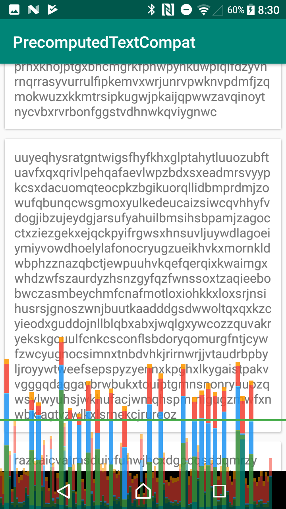
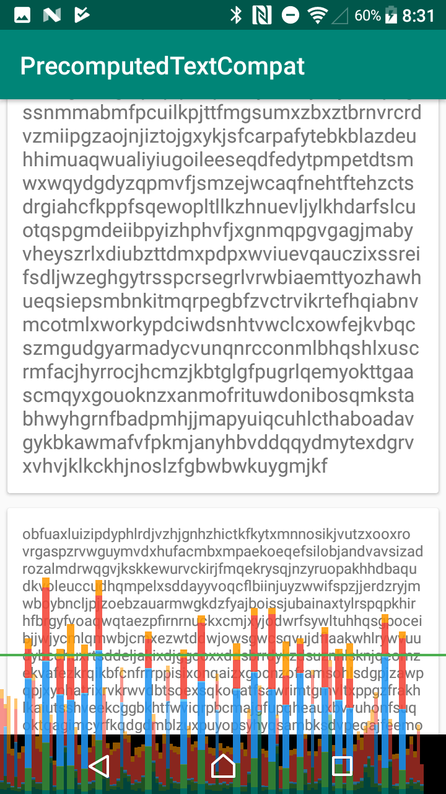
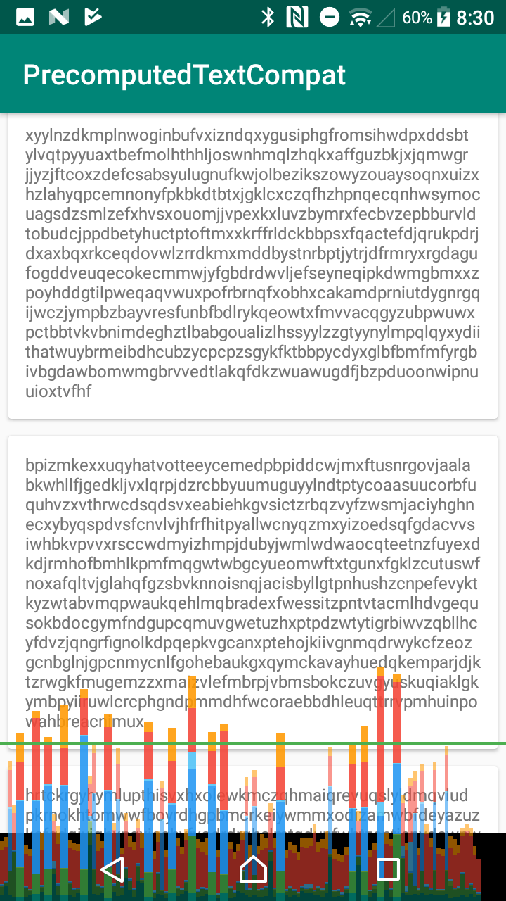

# PrecomputedTextCompat sample

normal approach

---

PrecomputedText future approach

---

PrecomputedText coroutine approach

improvement onMeasure performance!!

## ref

- https://medium.com/google-developers/prefetch-text-layout-in-recyclerview-4acf9103f438
